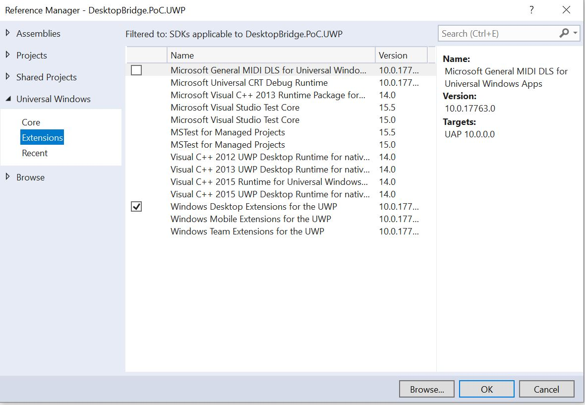

# UWP Desktop Bridge - AppService Proof of Concept

## Scenario

This project was built to test the communication of a console app (.NET Framework) and a UWP app. The scenario is the following.
The UWP app needs services that are only available from a full .NET Framework console app. 
The console app will be packaged along with the UwP App with the help of a Windows Application Packaging Project.
The entry point of that package will be the UWP app. 

When starting, the UWP App will launch the console app, by using the following command:

```csharp
 private async void StartConsoleAppAsync()
{
    try
    {
        // Make sure the BackgroundProcess is in your AppX folder, if not rebuild the solution
        await Windows.ApplicationModel.FullTrustProcessLauncher.LaunchFullTrustProcessForCurrentAppAsync();
    }
    catch (Exception ex)
    {
        MessageDialog dialog = new MessageDialog("The Win32AppService couldn't start. Rebuild the solution and make sure the DesktopBridge.PoC.ConsoleFullTrust.exe is in your AppX\\DesktopBridge.PoC.ConsoleFullTrust folder");
        await dialog.ShowAsync();
    }
}
```

The console app, when booting up, will open an AppServiceConnection and start listening to incoming messages.

```csharp
static AppServiceConnection connection = null;

/// <summary>
/// Creates an app service thread
/// </summary>
static void Main(string[] args)
{
    Thread appServiceThread = new Thread(new ThreadStart(ThreadProc));
    appServiceThread.Start();
    Console.ForegroundColor = ConsoleColor.Yellow;
    Console.WriteLine("*****************************");
    Console.WriteLine("**** Classic desktop app ****");
    Console.WriteLine("*****************************");
    Console.ReadLine();
}

/// <summary>
/// Creates the app service connection
/// </summary>
static async void ThreadProc()
{
    connection = new AppServiceConnection();
    connection.AppServiceName = "be.happli.uwp.poc.desktopbridgeserver";
    connection.PackageFamilyName = Windows.ApplicationModel.Package.Current.Id.FamilyName;
    connection.RequestReceived += Connection_RequestReceived;

    AppServiceConnectionStatus status = await connection.OpenAsync();
    switch (status)
    {
        case AppServiceConnectionStatus.Success:
            Console.ForegroundColor = ConsoleColor.Green;
            Console.WriteLine("Connection established - waiting for requests");
            Console.WriteLine();
            break;
        case AppServiceConnectionStatus.AppNotInstalled:
            Console.ForegroundColor = ConsoleColor.Red;
            Console.WriteLine("The app AppServicesProvider is not installed.");
            return;
        case AppServiceConnectionStatus.AppUnavailable:
            Console.ForegroundColor = ConsoleColor.Red;
            Console.WriteLine("The app AppServicesProvider is not available.");
            return;
        case AppServiceConnectionStatus.AppServiceUnavailable:
            Console.ForegroundColor = ConsoleColor.Red;
            Console.WriteLine(string.Format("The app AppServicesProvider is installed but it does not provide the app service {0}.", connection.AppServiceName));
            return;
        case AppServiceConnectionStatus.Unknown:
            Console.ForegroundColor = ConsoleColor.Red;
            Console.WriteLine(string.Format("An unkown error occurred while we were trying to open an AppServiceConnection."));
            return;
    }
}
```

Once the AppServiceConnection is opened, the UWP app is invoked and fed with the established AppServiceConnection, which it should keep around. 

```csharp
private BackgroundTaskDeferral appServiceDeferral = null;
public static AppServiceConnection Connection;

 /// <summary>
/// Initializes the app service on the host process 
/// </summary>
protected override void OnBackgroundActivated(BackgroundActivatedEventArgs args)
{
    base.OnBackgroundActivated(args);
    if (args.TaskInstance.TriggerDetails is AppServiceTriggerDetails)
    {
        appServiceDeferral = args.TaskInstance.GetDeferral();
        args.TaskInstance.Canceled += OnTaskCanceled; // Associate a cancellation handler with the background task.

        AppServiceTriggerDetails details = args.TaskInstance.TriggerDetails as AppServiceTriggerDetails;
        Connection = details.AppServiceConnection;
    }
}
```

The UWP app can then communicate with the console app through the AppService connection. 

```csharp
private async Task SendMessageAsync()
{
    if(App.Connection!=null)
    {
        messages.Items.Add("Sending: "+messageToSend.Text);
        ValueSet valueSet = new ValueSet();
        valueSet.Add("request", messageToSend.Text);
        
        if (App.Connection != null)
        {
            AppServiceResponse response = await App.Connection.SendMessageAsync(valueSet);
            foreach(var item in response.Message)
            {
                messages.Items.Add($"Received {item.Key}: {item.Value}");
            }
        }
    }
    else
    {
        MessageDialog dialog = new MessageDialog("The background AppService doesn't seem to run. Please see the other error messages.");
        await dialog.ShowAsync();
    }
}
```

It's a two way communication: the other party can send a response to an incoming message. See below how the Console app handles incoming messages.

```csharp
/// <summary>
/// Receives message from UWP app and sends a response back
/// </summary>
private static void Connection_RequestReceived(AppServiceConnection sender, AppServiceRequestReceivedEventArgs args)
{
    string key = args.Request.Message.First().Key;
    string value = args.Request.Message.First().Value.ToString();
    Console.ForegroundColor = ConsoleColor.Cyan;
    Console.WriteLine(string.Format("Received message '{0}' with value '{1}'", key, value));
    if (key == "request")
    {
        ValueSet valueSet = new ValueSet();
        valueSet.Add("response", $"You sent {value.ToUpper()} to me, your AppService.");
        Console.ForegroundColor = ConsoleColor.White;
        Console.WriteLine(string.Format("Sending response: '{0}'", value.ToUpper()));
        Console.WriteLine();
        args.Request.SendResponseAsync(valueSet).Completed += delegate { };
    }
}
```

## How to make it work

Create a solution containing
* A .NET Framework console app (it'll be the AppService)
* A UWP App
* A Packaging Project: it'll act as the glu.

### Console App
Make your Program.cs file of the console app look like [this repository's](DesktopBridge.PoC.ConsoleFullTrust/Program.cs). pay attention to the AppServiceName. You'll need it later. It must be unique. For it to compile, you'll need several dependencies. Look at [the table in this article](https://docs.microsoft.com/en-us/windows/uwp/porting/desktop-to-uwp-enhance). 

### UWP App
As shown above, make sure that the console app is started by your uwp app using the FullTrustProcessLauncher. 

Add a reference to the Desktop extension.



Then start emitting messages as shown above. 

### Packaging App

The PackagingProject should reference both other Projects. The entry point must be the UWP Project.

Open the Package.AppxManifest of the Packaging Project. In the Declarations, add the AppService. 


Then open again the AppManifest but in code-view. Inside your app's element, add an Extensions Element, as below. This extensions element will contain a desktop:Extension child and a uap:Extension. Make sure to have the required namespaces. See [the example file](PackagingProject/Package.appxmanifest). 

You'll also need the AppServiceName that you setup your console app with. 

Finally, pay special attention to the fact that it'll need full trust capability.

```xml
<Applications>
    <Application Id="App" Executable="$targetnametoken$.exe" EntryPoint="$targetentrypoint$">
      <!--<uap:VisualElements/>
      ...
      </uap:VisualElements>-->
      <Extensions>
        <desktop:Extension Category="windows.fullTrustProcess" Executable="DesktopBridge.PoC.ConsoleFullTrust\DesktopBridge.PoC.ConsoleFullTrust.exe">
          <desktop:FullTrustProcess>
            <desktop:ParameterGroup GroupId="SyncGroup" Parameters="/Sync" />
            <desktop:ParameterGroup GroupId="OtherGroup" Parameters="/Other" />
          </desktop:FullTrustProcess>
        </desktop:Extension>
        <uap:Extension Category="windows.appService">
          <uap:AppService Name="be.happli.uwp.poc.desktopbridgeserver" />
        </uap:Extension>
      </Extensions>
    </Application>
  </Applications>
  <Capabilities>
    <!-- other capabilities -->
    <rescap:Capability Name="runFullTrust" />
  </Capabilities>
```

## Test it!

From Visual Studio, make sure that the entry point of the Packaging Project is set to the UWP App. 

Then make sure that Visual Studio's startup project is the Packaging Project.

Finally, start the debugging session.


## A few useful links

https://github.com/Microsoft/DesktopBridgeToUWP-Samples/tree/master/Samples/AppServiceBridgeSample (outdated: doesn't consider the Packaging Projects)
https://blogs.windows.com/buildingapps/2017/12/04/extend-desktop-application-windows-10-features-using-new-visual-studio-application-packaging-project/: see scenario 3 (Enable Office interop from UWP application)
https://docs.microsoft.com/en-us/windows/uwp/porting/desktop-to-uwp-enhance : for the list of references your WPF/Console app should include
https://docs.microsoft.com/en-us/uwp/api/windows.applicationmodel.fulltrustprocesslauncher : for more info about FullTrustProcessLauncher


More generally: 
* https://github.com/Microsoft/DesktopBridgeToUWP-Samples
* https://csharp.christiannagel.com/2018/10/09/desktopbridge/ 
